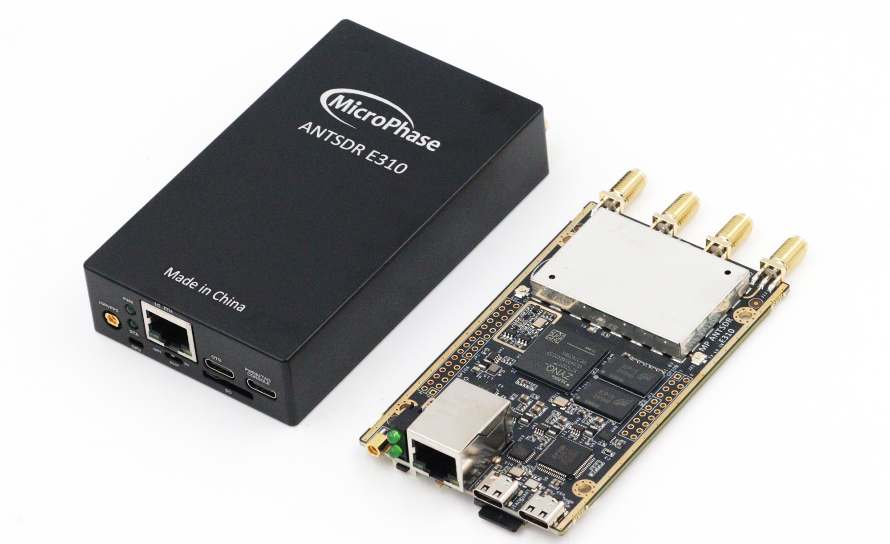

## E310 Hardware Manual

[[中文]](../../../cn/device_and_usage_manual/ANTSDR_E_Series_Module/ANTSDR_E310_Reference_Manual/AntsdrE310_Reference_Manual_cn.html)

### Overview

E310 is designed for customers who love SDR at the same time, and supports 70 MHz to 6 GHz signal transmission, which can be used for commercial use without any USB connection. When used externally, it is also possible to proceed with the actual operation of the machine. More than 100 original items support Japanese learning courses, and more customers can contact you for further development.

### Hardware Resources

- Xilinx Zynq-7020 (integrated dual-core ARM Cortex-A9 and Artix-7 FPGA)

- Analog Devices AD9361/9363 

- 1 trillion internet connections

- 1个TYPE-C USB 2.0 connector

- 1个TYPE-C USB-JTAG&UART connection

- 1个30-Pin 2.54mm GPIO expansion port

- 1个20-Pin 2.54mm GPIO expansion port

- 1 external PPS/10MHz reference entrance

- 2 transmit channels and 2 receive channels, supporting half-duplex or full-duplex operation.

- Flexible sampling rate 12-bit ADC and DAC

- Integrated RF front-end (AD9361: 70 MHz – 6 GHz, AD9363: 325 MHz – 3.8 GHz)

- Tunable analog bandwidth (AD9361: 200 kHz – 56 MHz, AD9363: 200 kHz – 20 MHz)
