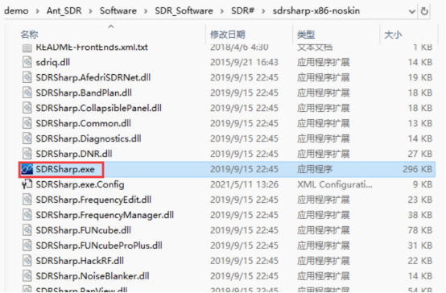

## E310 Unpacking examination

[[中文]](../../../../cn/html/device_and_usage_manual/ANTSDR_E_Series_Module/ANTSDR_E310_Reference_Manual/AntsdrE310_Unpacking_examination_cn.html)

### ●1. Overview

E310 is a software radio for makers and SDR enthusiasts, and can also meet professional application scenarios. It supports wide-band RF signal transmission and reception from 70 MHz to 6 GHz. It can be used as a USB peripheral or can be programmed to run offline. Numerous open source project support and learning tutorials make it possible for customers to access more applications.

### ●2. Item List

Thank you for purchasing the ANTSDR series software radio platform from Microphase Technology Co., Ltd. When you get the ANTSDR E310 (standard version), open the accessory package, which should contain the following:

- ANTSDR software radio: X1

- USB data cable: X2 

- Short rubber stick antenna: X2

- Tray antenna: X1

- Card reader: X1

- Network cable: X1

- 32GB SD card: X1

After opening the package, start unpacking inspection

### ●3. Antsdr device software installation 

Next, use the **pluto firmware** to listen to the radio 

The factory default firmware of ANTSDR E310 is pluto firmware, no need to change.

If you don't have pluto firmware，can be downloaded from github：[download antsdr pluto firmware](https://github.com/MicroPhase/antsdr-fw-patch/releases)

E310 has burned the Pluto firmware into QSPI when it leaves the factory. Therefore, using the Pluto firmware is a relatively simple matter. The pluto firmware default ip is **192.168.1.10** ,The username and password are **root analog**.The baud rate is **115200**.

The DIP switch for setting the boot mode is under the network port.  you can clearly see the words BOOT QSPI SD under the network port of the shell.The firmware in the SD card and the firmware in the QSPI of E310 are both pluto firmware, no matter what boot method is used, they are all pluto firmware. When you power on, you will see a flashing green light

### ● Windows 

[download plutosdr drivers](https://wiki.analog.com/university/tools/pluto/drivers/windows)

[download Serial drvices](https://ftdichip.com/wp-content/uploads/2021/08/CDM212364_Setup.zip)

○1. Install Windows drivers： CDM212364_Setup.exe and PlutoSDR-M2K-USB-Drivers.exe.
Then connect one end of the network cable to ANTSDR and the other end to the computer.Connect the antenna to the rx1 port

○2. After that you can see the plutoSDR device in Computer Management -> Device Manager .

If not, please check whether your firmware is correct, whether your driver is installed, and whether your USB OTG line sequence is correct.

○3. Set the local IP address, subnet mask, and gateway in sequence. Set the local IP address to the same network segment as ANTSDR, for example, 192.168.1.100. Set the subnet mask to 255.255.255.0 and the default gateway to 192.168.1.1

○4. The antsdr device IP is 192.168.1.10. At this time, you need to open the cmd window and ping 192.168.1.10

○5. Listen to the radio

Run SDRSharp.exe file in Windows to listen to the radio

The antsdr device IP is 192.168.1.10

After the connection is successful, select the radio channel and start listening to the radio.

### ● Linux

○1. The pluto firmware default ip is **192.168.1.10**, set the local ip address to **192.168.1.100**, then **ping 192.168.1.100**.

○2. You can refer to this link to install [libiio](https://wiki.analog.com/resources/eval/user-guides/ad-fmcdaq2-ebz/software/linux/applications/libiio#:~:text=Libiio%20is%20a%20library%20that%20has%20been%20developed,of%20software%20interfacing%20Linux%20Industrial%20I%2FO%20%28IIO%29%20devices.)

or

You can find detailed steps for installing libiio in [AntsdrE310 Gnurdio](./AntsdrE310_gnurdio.md)

○3. If you have already installed libiio,Execute iio_info -s

Can be connected via Gigabit Ethernet or USB OTG. 
Open the sdr++ software. 
After the connection is successful, you can start listening to the radio

