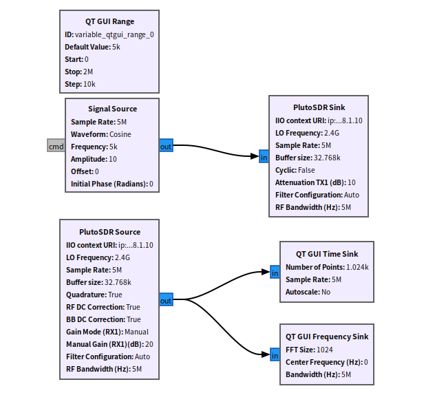
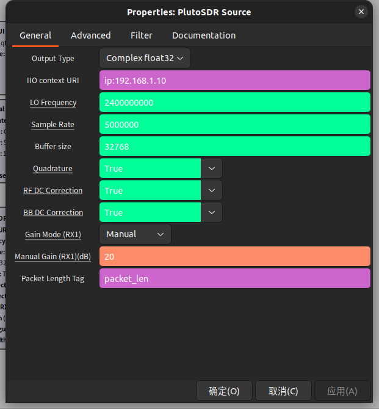
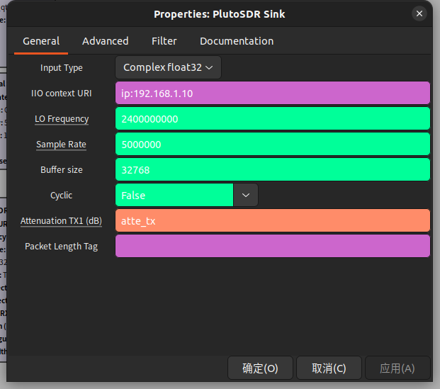

## E310 gnuradio

[[中文]](../../../../../cn/html/device_and_usage_manual/ANTSDR_E_Series_Module/ANTSDR_E310_Reference_Manual/AntsdrE310_gnurdio_cn.html)


### ●1. Overview
[Gnuradio](https://www.gnuradio.org/) is an open source software

[Gnuradio](https://www.gnuradio.org/) is a free software development kit that provides signal processing blocks for implementing software
defined radios and signal processing systems. It can be used with external RF hardware to create software-defined radios, or without hardware in a simulation-like environment. It is widely used in amateur, academic, and commercial environments to support wireless communications research and real-world radio systems.

The GNURadio software provides a framework and tools for building and running software radios or just general signal processing applications. GNURadio applications themselves are often called "flowgraphs", which are a series of signal processing blocks connected together, describing the flow of data. These flowgraphs can be written in C++ or Python programming languages. The GNURadio infrastructure is written entirely in C++, while many user tools are written in Python.

As with all software-defined radio systems, reconfigurability is a key feature. GNU Radio's open interfaces make it easy to integrate users' own radio equipment into the GNU Radio ecosystem without designing for specific hardware.

### ●2. libiio installation on unutu
Different Ubuntu versions are different. You can refer to the installation materials for details:
[gnuradio install](https://wiki.analog.com/resources/tools-software/linux-software/gnuradio)
#### ○1. install system packages
Before installing the Pluto SDR driver, install the required dependencies and enter the following command
```
sudo apt install libxml2 libxml2-dev bison flex cmake git libaio-dev libboost-all-dev
sudo apt install libusb-1.0-0-dev
sudo apt install libavahi-common-dev libavahi-client-dev
sudo apt install bison flex cmake git libgmp-dev
sudo apt install swig
sudo apt install liborc-dev
```
#### ○2. install libiio
You can find the latest version on [github](https://github.com/analogdevicesinc/libiio)

```
git clone -b v0.24 https://github.com/analogdevicesinc/libiio.git
cd libiio
mkdir build
cd build
cmake ../
make
sudo make install
cd ../..
```
#### ○3. install libad9361-iio

```
git clone https://github.com/analogdevicesinc/libad9361-iio.git
cd libad9361-iio
mkdir build
cd build
cmake ../
make
sudo make install
cd ../..

```
### ●3. gnuradio and gr-iio


#### install gnuradio


```
apt-get update
apt install gnuradio -y
ldconfig
```
After the installation is complete, check the installed version

```
gnuradio-companion -help
```

#### install gr-iio

gr-iio in 3.8+ requires liborc-dev

```
(sudo) apt install liborc-dev
```
Build and install gr-iio from source:

```
git clone -b upgrade-3.8 https://github.com/analogdevicesinc/gr-iio.git
cd gr-iio
mkdir build && cd build
cmake -DCMAKE_INSTALL_PREFIX:PATH=/usr ..
make 
sudo make install
cd ..
sudo ldconfig
```

For 3.8, make sure the gr-iio swig interface is on your PYTHONPATH. Otherwise, you will get import errors in python. The common command would be (depending on OS and install location):
```
export PYTHONPATH=$PYTHONPATH:/usr/lib/python{PYTHON VERSION}/{site or dist}-packages
```
The added path is the location of the newly installed iio folder.
For 3.8.2 no additional steps have to be taken


#### gnuradio3.10

If you are using gnuradio 3.10 or newer, gr-iio is already provided in the base installation of gnuradio itself,No need to install gr-iio.

After all installations are complete, we can open Gnuradio in the terminal
```
gnuradio-companion
```

### ●4. Using the Pluto blocks

Before use, you need to use the pluto firmware. You can find the pltuo firmware usage here [Unpacking examination](./AntsdrE310_Unpacking_examination.md)

You can find the antsdr gnuradio example here:

[gnuradio demo](https://github.com/MicroPhase/gnu-radio-demo)



#### ○General
**IIO Context URI**: IP:192.168.1.10

**Buffer Size**: The size of the internal buffer in samples. The IIO module can only input/output one buffer containing samples at a time

#### ○PlutoSDR source

○**RF Bandwidth(MHz)**: Configures RX analog filters: RX TIA LPF and RX BB LPF.[Read more](https://wiki.analog.com/resources/tools-software/linux-drivers/iio-transceiver/ad9361#rx_rf_bandwidth_control)

○**Sample Rate(MSPS)**: Frequency at which the hardware will input/output samples.[Read more](https://wiki.analog.com/resources/tools-software/linux-drivers/iio-transceiver/ad9361#settingquerying_the_rx_sample_rate)

○**LO Frequency(MHz)**: Selects the RX local oscillator frequency. Range 70MHz to 6GHz with 1Hz tuning granularity.[Read more](https://wiki.analog.com/resources/tools-software/linux-drivers/iio-transceiver/ad9361#local_oscillator_control_lo)

○**Tracking**: [Read more](https://wiki.analog.com/resources/tools-software/linux-drivers/iio-transceiver/ad9361#calibration_tracking_controls)

○Quadrature

○RF DC

○BB DC

○**Manual Gain(dB)**: Controls the RX gain only in Manual Gain Control Mode (MGC). [Read more](https://wiki.analog.com/resources/tools-software/linux-drivers/iio-transceiver/ad9361#mgc_setting_the_current_gain)

○**Gain Mode**: Selects one of the available modes: manual, slow_attack, hybrid and fast_attack. [Read more](https://wiki.analog.com/resources/tools-software/linux-drivers/iio-transceiver/ad9361#gain_control_modes)

○**Filter**: Allows a FIR filter configuration to be loaded from a file. [Read more](https://wiki.analog.com/resources/tools-software/linux-drivers/iio-transceiver/ad9361#digital_fir_filter_controls)

○**Filter auto** When enabled loads a default filter and thereby enables lower sampling / baseband rates.



#### ○PlutoSDR sink

○**RF Bandwidth(MHz)**: Configures TX analog filters: TX BB LPF and TX Secondary LPF. [Read more](https://wiki.analog.com/resources/tools-software/linux-drivers/iio-transceiver/ad9361#tx_rf_bandwidth_control)

○**Sample Rate(MSPS)**: Frequency at which the hardware will input/output samples . [Read more](https://wiki.analog.com/resources/tools-software/linux-drivers/iio-transceiver/ad9361#settingquerying_the_tx_sample_rate)

○**LO Frequency(MHz)**: Selects the TX local oscillator frequency. Range 70MHz to 6GHz with 1Hz tuning granularity. [Read more](https://wiki.analog.com/resources/tools-software/linux-drivers/iio-transceiver/ad9361#local_oscillator_control_lo)


○**RF Port Select**: Selects the RF port to be used.[Read more](https://wiki.analog.com/resources/tools-software/linux-drivers/iio-transceiver/ad9361#rf_port_selection)

○**Attenuation (dB)**: Individually controlls attenuation for TX1 and TX2. The range is from 0 to -89.75 dB in 0.25dB steps.[Read more](https://wiki.analog.com/resources/tools-software/linux-drivers/iio-transceiver/ad9361#tx_attenuation_control)

○**Cyclic**: Set to “true” if the “cyclic” mode is desired. In this case, the first buffer of samples will be repeated on the enabled channels of the FMCOMMS-2 until the program is stopped.
The FMCOMMS-2 IIO block will report its processing as complete: the blocks connected to the PlutoSDR IIO block won't execute anymore, but the rest of the flow graph will.

○**Filter**: Allows a FIR filter configuration to be loaded from a file. [Read more](https://wiki.analog.com/resources/tools-software/linux-drivers/iio-transceiver/ad9361#digital_fir_filter_controls)

○**Filter auto** When enabled loads a default filter and thereby enables lower sampling / baseband rates.




### ●4. Using the fmcomms blocks

Before use, you need to use the fmcomms firmware. You can find the usage of the fmcomms firmware here [Unpacking examination](./AntsdrE310_fmcomms.md)

The FMCOMMS-2 IIO blocks can run over the IP network or USB. By setting the “IIO context URI” parameter to the IP address of the target board, you can stream samples from/to the remote board


**IIO Context URI**: IP:192.168.1.10

**Buffer Size**: The size of the internal buffer in samples. The IIO module can only input/output one buffer containing samples at a time

#### ○fmocmms source
○**RF Bandwidth(MHz)**: Configures TX analog filters: TX BB LPF and TX Secondary LPF. [Read more](https://wiki.analog.com/resources/tools-software/linux-drivers/iio-transceiver/ad9361#rx_rf_bandwidth_control)

○**Sample Rate(MSPS)**: Frequency at which the hardware will input/output samples . [Read more](https://wiki.analog.com/resources/tools-software/linux-drivers/iio-transceiver/ad9361#settingquerying_the_rx_sample_rate)

○**LO Frequency(MHz)**: Selects the TX local oscillator frequency. Range 70MHz to 6GHz with 1Hz tuning granularity. [Read more](https://wiki.analog.com/resources/tools-software/linux-drivers/iio-transceiver/ad9361#local_oscillator_control_lo)

○**RF Port Select**: Selects the RF port to be used. Can be either any of the inputs on the Rx input mux (in single ended or differential) or the Tx monitor input. [Read more](https://wiki.analog.com/resources/tools-software/linux-drivers/iio-transceiver/ad9361#rf_port_selection)

○**Tracking**: [Read more](https://wiki.analog.com/resources/tools-software/linux-drivers/iio-transceiver/ad9361#calibration_tracking_controls)

○Quadrature

○RF DC

○BB DC

○**Manual Gain(dB)**: Controls the RX gain only in Manual Gain Control Mode (MGC). [Read more](https://wiki.analog.com/resources/tools-software/linux-drivers/iio-transceiver/ad9361#mgc_setting_the_current_gain)

○**Gain Mode(RX1, RX2)**: Selects one of the available modes: manual, slow_attack, hybrid and fast_attack. [Read more](https://wiki.analog.com/resources/tools-software/linux-drivers/iio-transceiver/ad9361#gain_control_modes)


#### ○fmocmms sink

○**RF Bandwidth(MHz)**: Configures TX analog filters: TX BB LPF and TX Secondary LPF. [Read more](https://wiki.analog.com/resources/tools-software/linux-drivers/iio-transceiver/ad9361#rx_rf_bandwidth_control)

○**Sample Rate(MSPS)**: Frequency at which the hardware will input/output samples . [Read more](https://wiki.analog.com/resources/tools-software/linux-drivers/iio-transceiver/ad9361#settingquerying_the_rx_sample_rate)

○**LO Frequency(MHz)**: Selects the TX local oscillator frequency. Range 70MHz to 6GHz with 1Hz tuning granularity. [Read more](https://wiki.analog.com/resources/tools-software/linux-drivers/iio-transceiver/ad9361#local_oscillator_control_lo)

○**RF Port Select**: Selects the RF port to be used. Can be either any of the inputs on the Rx input mux (in single ended or differential) or the Tx monitor input. [Read more](https://wiki.analog.com/resources/tools-software/linux-drivers/iio-transceiver/ad9361#rf_port_selection)

**Attenuation(RX1, RX2)(dB)**: Individually controlls attenuation for TX1 and TX2. The range is from 0 to -89.75 dB in 0.25dB steps.[Read more](https://wiki.analog.com/resources/tools-software/linux-drivers/iio-transceiver/ad9361#tx_attenuation_control)


○**Cyclic**: Set to “true” if the “cyclic” mode is desired. In this case, the first buffer of samples will be repeated on the enabled 
channels of the FMCOMMS-2 until the program is stopped.

The FMCOMMS-2 IIO block will report its processing as complete: the blocks connected to the FMCOMMS-2 IIO block won't execute anymore, but the rest of the flow graph will.

○**TX1/TX2** Enabled: Enables the transmit data path

○**Filter**: Allows a FIR filter configuration to be loaded from a file. [Read more](https://wiki.analog.com/resources/tools-software/linux-drivers/iio-transceiver/ad9361#digital_fir_filter_controls)

○**Filter auto** When enabled loads a default filter and thereby enables lower sampling / baseband rates.


