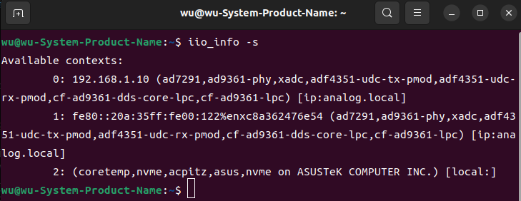

## E310 libiio

[[中文]](../../../../../cn/html/device_and_usage_manual/ANTSDR_E_Series_Module/ANTSDR_E310_Reference_Manual/AntsdrE310_libiio_cn.html)

### ●1. Overview

Libiio is a library developed by Analog Devices to simplify software development for interfacing with Linux industrial I/O (II0) devices, and provides a simple and complete programming interface that can be used for advanced projects. Here, we compile an example provided by Libiio and run it on a host and an embedded platform respectively. This example configures the RF end through a c/c++ interface and fills in the IQ data stream for sending and receiving. This document is suitable for people with a basic understanding of programming, and involves c/c++, cross-compilation, etc. The content introduced in this chapter runs on the Linux platform (Ubuntu).

### ●2. Install the libiio

If you don't have libiio installed, install libiio first

You can refer to this link to install [Libiio](https://wiki.analog.com/resources/eval/user-guides/ad-fmcdaq2-ebz/software/linux/applications/libiio#:~:text=Libiio%20is%20a%20library%20that%20has%20been%20developed,of%20software%20interfacing%20Linux%20Industrial%20I%2FO%20%28IIO%29%20devices.)

or

You can find detailed steps for installing libiio in [AntsdrE310 gnurdio](./AntsdrE310_gnurdio.md)


If you successfully installed libiio, execute iio_info -s



### ●3. Source code
Microphase has provided source code for users. Here we need to compile the ad9361-iiostream.c file and run it. First, create a new folder (libiio_example) and create folders named arm and host under the folder. Copy the ad9361-iiostream.c file to the above folders.

[Source code address](https://github.com/MicroPhase/antsdr_doc_en/tree/master/demo/iio)

You need to download the code

After the download is complete, go to the directory where you downloaded it.

If you run the program directly on your computer,You need to run the following command
```
mkdir build && cd build
cmake ..
make
./ad9361-iiostream
```
Execute ./ad9361-iiostream and you will see the result as shown below


If you run the program directly on arm, you need cross-compilation knowledge. We need arm compilation tools. The 32-bit compiler tool that comes with the Xilinx SDK is used here. The version of the compilation tool and the version of the firmware need to be consistent.
```
set (CMAKE_C_COMPILER "/tools/Xilinx/SDK/2019.1/gnu/aarch32/lin/gcc-arm-linux-gnueabi/bin/arm-linux-gnueabihf-gcc")
set (CMAKE_CXX_COMPILER "/tools/Xilinx/SDK/2019.1/gnu/aarch32/lin/gcc-arm-linux-gnueabi/bin/arm-linux-gnueabihf-g++")

```
You can find the relationship between the compilation toolchain and version in [antsdr-fw-patch](./Antsdr-fw-patch.md)

Use the scp command to send it to ANTSDR and run
```
scp ad9361-iiostream root@192.168.1.10:~
```
Log in to the board via ssh or serial port
```
./ad9361-iiostream
```
Readers can find the libiio interface here：
[https://analogdevicesinc.github.io/libiio/master/libiio/index.html](https://analogdevicesinc.github.io/libiio/master/libiio/index.html)