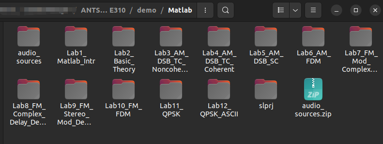
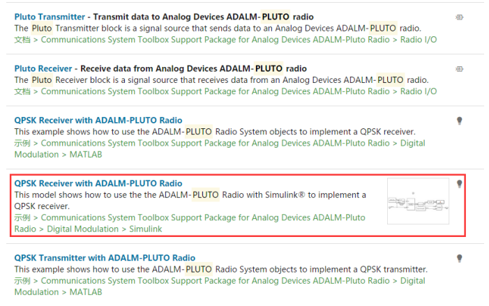
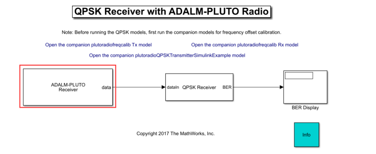

## E310 matlab


[[中文]](../../../../cn/html/device_and_usage_manual/ANTSDR_E_Series_Module/ANTSDR_E310_Reference_Manual/AntsdrE310_matlab_cn.html)

### ●1. Overview

Using ANTSDR, users can easily access various SDR software and try various interesting radio experiments. For example, in GNU Radio and Matlab&simulink, users can implement communication and signal processing related algorithms on the software, and then use ANTSDR to transmit and receive signals. Or you can use open source software to perform interesting functions such as broadcast demodulation, TV signal demodulation, aircraft tracking, etc.

This chapter will install the PlutoSDR hardware support package. All Matlab-related experiments are conducted under the Windows 10 platform, so it is necessary to install the driver under Windows 10 so that we can use the ANTSDR hardware device correctly. Regarding the download and installation of Matlab & Simulink, users can register and download and install on the Matlab official website.

If you want to use MATLAB under Ubuntu, the steps are the same as those for Windows.

If you are using antsdr for the first time, you need to read [Unpacking examination](./AntsdrE310_First_boot_check.md)

### ●2. Install the driver

If you don't have the plutosdr driver installed, you can download it
[download windows driver](https://wiki.analog.com/university/tools/pluto/drivers/windows)

The corresponding driver is also provided in the information. Double-click the exe file to install it. Keep clicking Next to install the driver.

ANTSDR uses a ZYNQ processor that contains two A9 cores and can run an operating system. has ported the firmware of PlutoSDR, so we can also access the hardware devices on ANTSDR through the command line.

The pluto firmware can be downloaded from github.[download antsdr pluto firmware](https://github.com/MicroPhase/antsdr-fw-patch/releases)

### ●3. Installing Hardware Support Packages

The author installs the matlab2018.a version here. Users can choose 2018.a and above versions to install by themselves. The Simulink simulation models in the provided materials are all based on the 2018.a version.

After installing Matlab, you need to install the hardware support package of PlutoSDR to use ANTSDR. Select Additional Features in the upper menu bar and select Get Hardware Support Package

Search for pluto and click PlutoSDR Communication Tool Component to install the hardware support package.
When installing the hardware support package, you need a Mathworks account. Users can register a Mathworks account online and then log in.

of course,
You can find the installation steps of ADALM-PLUTO on the official website of matlab

Or you can find the detailed installation process of ANTSDR Matlab in the documentation

[Install Support Package for Analog Devices ADALM-PLUTO Radio](https://ww2.mathworks.cn/help/comm/plutoradio/ug/install-support-package-for-pluto-radio.html)

After the installation is complete, you need to close all open Matlabs, then restart Matlab and proceed to the subsequent steps.


When the ANTSDR system is started, the Ethernet IP address is 192.168.1.10. In order for the host to access ANTSDR normally, the computer's IP address needs to be set to the same network segment as ANTSDR. You can refer to the network settings in the [Unpacking examination](./AntsdrE310_Unpacking_examination.md).


### ●4.Test Connection

After setting the IP address of the host computer, you can use the PlutoSDR sample program in Matlab to test the current ANTSDR connection status.

In the provided materials you can find all the matlab demos related to this


Enter pluto in the search box in the upper right corner to search, and then open a simulink simulation model in the pop-up window.




Select Open Model to open the simulation model.



Double-click the ADALM-PLUTO receiver module to open the settings window. In the settings window, set Radio ID to

```
ip:192.168.1.10
```

Then click Apply, and then click Info to see the information of the current device.


