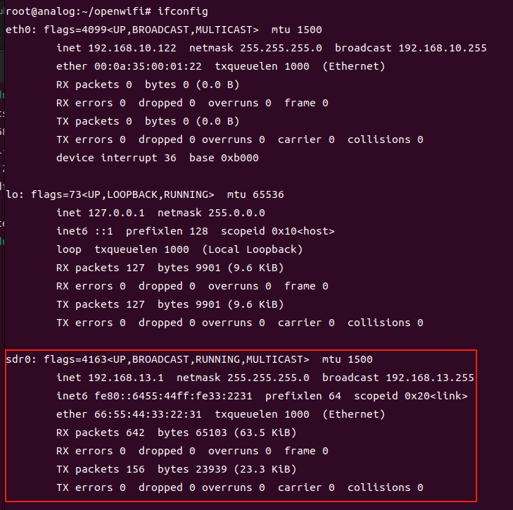

## E310 openwifi


[[中文]](../../../cn/device_and_usage_manual/ANTSDR_E_Series_Module/ANTSDR_E310_Reference_Manual/AntsdrE310_openwifi_cn.html)

### ●1. Overview
Openwifi is an open source project based on ZYNQ7000+AD936x. This project implements an IP core for processing wifi signals on FPGA to meet the delay requirements of wifi transmission. This project also implements the driver of openwifi IP on linux. Based on this open source project, users can understand the underlying working principle of wifi. Interested users can learn more about it on the github homepage of the project. The Github repository address is as follows.

[https://github.com/open-sdr/openwifi](https://github.com/open-sdr/openwifi)

we will introduce how to use ansdr e310 to run openwifi

### ●2. Burning images in Ubuntu

Before you start, you need to download openwifi img

[Download openwifi img](https://drive.google.com/file/d/12egFLT9TclmY8m3vCMHmUuSne3qK0SWc/view?pli=1)

Unzip and burn to SD card (>=16GB). After that, the SD card should have two partitions: BOOT and rootfs. To burn the SD card, you can use the dd command to burn the image to the sd card

```
sudo dd bs=512 count=31116288 if=openwifi-xyz.img of=/dev/your_sdcard_dev
(To have correct count value, better to check the .img file actual situation by "fdisk -l img_filename")
```
After the SD card is burned,
Insert the SD card into the computer and copy the startup file to the BOOT partition of the SD card.


### ●3.Start the system

 insert the SD card into ANTSDR. Change the DIP switch to SD card boot. At this time, connect the power supply and the system will start. If you want to observe the print information of the system startup, you can use the terminal tool to connect to the serial port.
```
sudo screen /dev/ttyUSB1 115200
```
After the system is started, you can enter the following command in the serial terminal to make ANTSDR
E310 a wifi router.

```
./openwifi/setup_once.sh (Reboot the board. Only need to run once for new board)
cd openwifi
./wgd.sh
./fosdem.sh
```
After the command is finished, you can see that the printed information will appear sdr0:AP-ENABLED, which means that ANTSDR is ready to function as a wifi AP. At this time, you can use the ifconfig command to see that there is an additional sdr0 in the current network device.



At this time, the user takes out his mobile phone, turns on wifi and should be able to search for a device called openwif.


Currently, the wifi cannot access the Internet, but after connecting to the wifi, the built-in web page of openwifi can be opened. When connected to openwifi, users can enter 192.168.13.1 in the browser to open the built-in web page of openwifi.

If the user wants to connect to the Internet through openwifi running on ANTSDR, the user needs to have a Linux computer, use an Ethernet cable to connect ANTSDR E310 to the network port of the Linux computer, and then enter the following command in the Linux system terminal
```
sudo sysctl -w net.ipv4.ip_forward=1
sudo iptables -t nat -A POSTROUTING -o NICY -j MASQUERADE
sudo ip route add 192.168.13.0/24 via 192.168.10.122 dev ethX 
```
NICY is another network device on the user's computer that can connect to the Internet, such as wlan0, and ethX is the Ethernet device port that the user connects to ANTSDR.

Example

```
sudo sysctl -w net.ipv4.ip_forward=1
sudo iptables -t nat -A POSTROUTING -o wlan0 -j MASQUERADE
sudo ip route add 192.168.13.0/24 via 192.168.10.122 dev eth0
```
At this point, you can use your mobile phone to connect to openwifi and then connect to the Internet through openwifi. In this way, ANTSDR E310 becomes a simple wifi router.